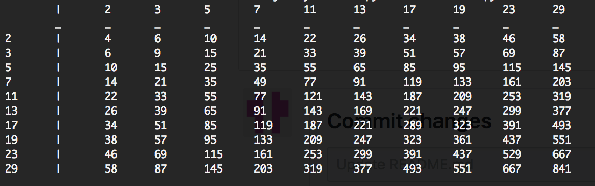

# uniteus Backend Challenge

## Objective
Write a program that prints out a multiplication table of the first 10 primary numbers. 

The program must run from the command line and print one table to STDOUT. The first row 
and column of the table should have the 10 primes, with each cell containing the product
of the primes for the corresponding row and column.

## Notes
Lot of fun doing this challenge. Some notes on my implementation:

Ran on Python 2.7 because this is what I had, would run on Python 3 else-wise.
Algorithm for finding prime is super basic, just a 6k + 1 implementation, fast enough for the challenge however. 
Complexity for my finding prime function is fairly high could fix using myriad of methods to make faster.
Overall, my code is scalable to a point, where after trying to find a couple thousand prime numbers it would run slow.

speed my code runs to find first 10 primary numbers:

real	0m0.054s\
user	0m0.012s\
sys	0m0.013s

## How to run
Open terminal (in MacOSX)
move to folder where files exist
Download Python 2.7
and run "python backendCode.py -i 10"
in terminal

output should be:

